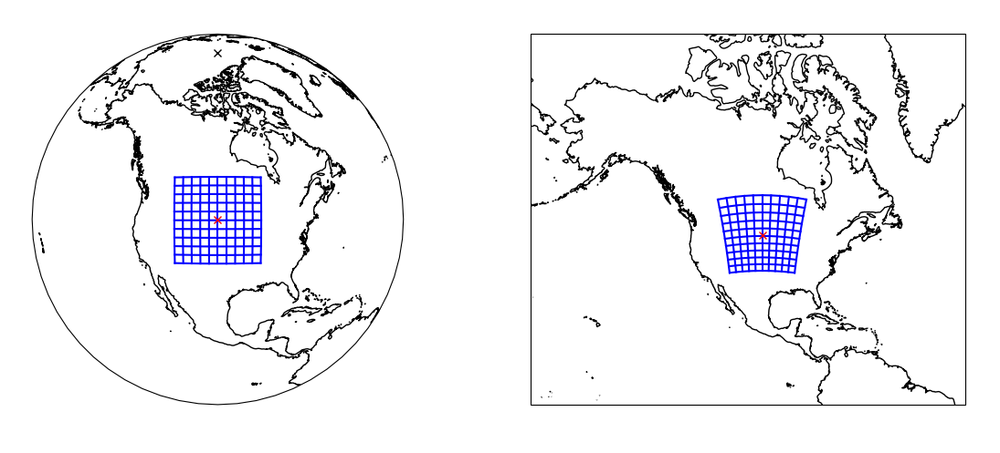
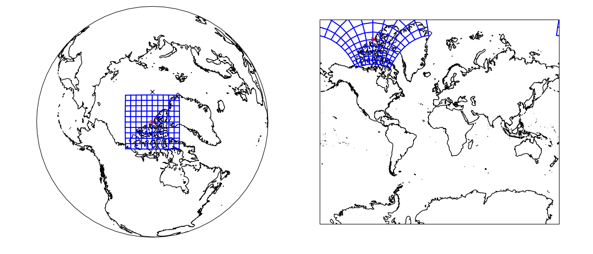

# gnss-tid

Detect traveling ionospheric disturbances (TIDs) from GNSS-derived total
electron content (TEC). The pipeline projects scattered receiver-satellite
observations onto a local 2-D grid, builds detrended TEC images at candidate
ionospheric-piercing-point (IPP) heights, runs rolling-window FFTs to focus on
the height that maximises spectral power, and fits a circular-wavefront source
(centre, wavelength, phase) across all time slices.

## Library usage

### `Local2D` projection

`Local2D` is a local-cartesian frame centered on a geodetic origin at IPP
height (km). All downstream geometry — the image grid, patch positions, and
the fitted source centre — lives in this frame, so the projection has to be
built once and shared between `get_data` and the image maker.

    import numpy as np
    from gnss_tid.coords import Local2D

    proj = Local2D.from_geodetic(lat=37.5, lon=-98.0, height=350.0)

Forward projection takes geodetic degrees to local `x, y` in km from the
origin:

    lat = np.array([40.0, 30.0])
    lon = np.array([-100.0, -90.0])
    x, y = proj.convert_from_spherical(lat, lon)

The inverse maps local coordinates back to geodetic, useful as a round-trip
check or for labelling plots with lat/lon:

    lat_back, lon_back = proj.convert_to_spherical(x, y)

Two example regions, projected:

| US | Polar |
|---|---|
|  |  |

### Image generation

Turning scattered observations into a gridded TEC image takes four pieces: the
observations themselves, a projection, an image maker, and a per-slice data
selector.

`load_observations` concatenates all matching files, applies the geographic
and time clips, masks rays below `el_min` degrees of elevation, and drops the
top `1 - q_thresh` fraction of TEC magnitudes as outliers. It returns a
DataFrame of observations with geodetic IPP coordinates and a receiver lookup
table:

    from gnss_tid.pointdata import load_observations, make_time_windows, get_data
    from gnss_tid.image import ScipyRbfImageMaker
    from gnss_tid.coords import Local2D

    obs, rx = load_observations(
        files=["/disk1/tid/2015/0325/*.nc"],
        lat_limits=(24.0, 51.0),
        lon_limits=(-126.0, -70.0),
        time_limits=("20150325_233500", "20150325_235500"),
        el_min=30,
        q_thresh=0.99,
    )

Build the projection at the center of the box, at the IPP height we'll work
at:

    proj = Local2D.from_geodetic(np.mean(lat_limits), np.mean(lon_limits), 350.0)

Configure the image maker. The arguments here match
`focus/image_maker/rbf.yaml`: a scattered-point RBF interpolator with a
Butterworth high-pass on the resulting raster and a density mask used by
downstream code to ignore sparse regions.

    maker = ScipyRbfImageMaker(
        hres=20,                # grid resolution (km / pixel)
        hp_freq=0.02,           # Butterworth high-pass cutoff (cycles / pixel)
        neighbor_radius=100.0,  # density-mask radius (km)
        neighbors=50,           # RBF neighborhood size
        kernel="multiquadric",
        smoothing=0.3,
    )

`initialize_from_bounds` projects the lat/lon box perimeter through `proj`,
takes the bounding box of the projected perimeter as the grid extent, and
populates `maker.xp`, `maker.yp`, and `maker.points`:

    maker.initialize_from_bounds(proj, lat_limits, lon_limits)

`make_time_windows` groups the observation timestamps into sliding
4-timestamp windows with stride 2. Each window is the set of observations
that will go into one image.

    windows = make_time_windows(obs, window=4, step=2)

`get_data` extracts a single window's observations, projects their IPPs at
`h=350 km` through `proj`, clips to the lat/lon box, and returns a DataFrame
with `x, y` (km) and a `dtec1` column:

    slice_df = get_data(
        obs, rx, windows[0], h=350.0,
        lat_limits=lat_limits, lon_limits=lon_limits, proj=proj,
    )

Finally, the image maker is callable: pass the projected `x, y, tec` arrays
and you get back an `xarray.Dataset` with two variables — `image (y, x)`, the
high-pass filtered TEC on the grid, and `density (y, x)`, the count of input
points within `neighbor_radius` of each pixel.

    img = maker(
        slice_df["x"].values,
        slice_df["y"].values,
        slice_df["dtec1"].values,
    )
    img.image.plot(vmin=-0.3, vmax=0.3, cmap="bwr")

### Patch FFT spectra

Once you have an image, you can run rolling 2-D FFTs over it to get the local
spatial spectrum at every patch. This is the core operation that drives
`run_spectral_focusing`.

First, build a 2-D Kaiser window. Applying it to each patch before the FFT
suppresses spectral leakage from the block edges. The reshape broadcasts the
same `(block_size, block_size)` window across the patch grid:

    from gnss_tid.fft import make_kaiser_2d
    from gnss_tid.spectral import compute_patch_spectra

    block_size = 32
    window = make_kaiser_2d(block_size, beta=1.0).reshape(
        1, 1, block_size, block_size,
    )

`compute_patch_spectra` slides a `block_size × block_size` window over the
image with the given stride, applies the Kaiser window, and FFTs each block.
With `block_step=16` you get 50 % overlap between neighbouring patches. The
output has dims `(py, px, ky, kx)`; the `kx` and `ky` coordinates are
wavenumbers in cycles/km, inferred from `img.x` spacing.

    spectra = compute_patch_spectra(
        img.image,
        block_size=block_size,
        block_step=16,
        window=window,
    )

To eyeball whether the peak at a given location is a real lobe rather than a
single noisy bin, slice out one patch's full 2-D spectrum:

    spectra.isel(px=10, py=10).plot()

For the more compact summary used by the rest of the pipeline — just the peak
power and peak wavenumber at each patch — pipe through
`gnss_tid.spectral.extract_patch_peaks(spectra)`, which returns `F`, `Fx`,
`Fy`, and a scalar `objective` (sum of `F` over patches).
