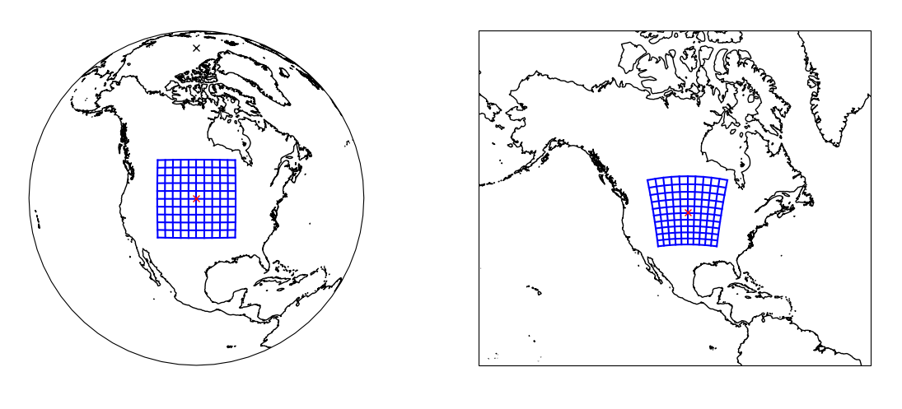

# gnss-tidi

### Links
- [Trello Link](https://trello.com/b/Yy8y614c/onr24-tid)
- [Box Link](https://jhuapl.app.box.com/folder/247818918892)

# GNSS Traveling Ionospheric Distrubances Imaging software.
This software package contains python scripts for converting line-of-sight GNSS TEC obervations into TID maps.

Image interpolations implemented with
- moving Gaussian window
- moving median window
- MetPy natural neighbor (NN) interpolation to grid and to data point

Image conversion from geographic / spherical to regional cartesian coordinate system

Spectral focusing of the images as a function of projection altitude based on 2D DFT

# coordinate transform

### US example

### Polar Example

